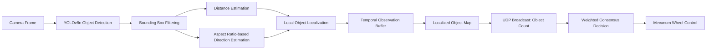
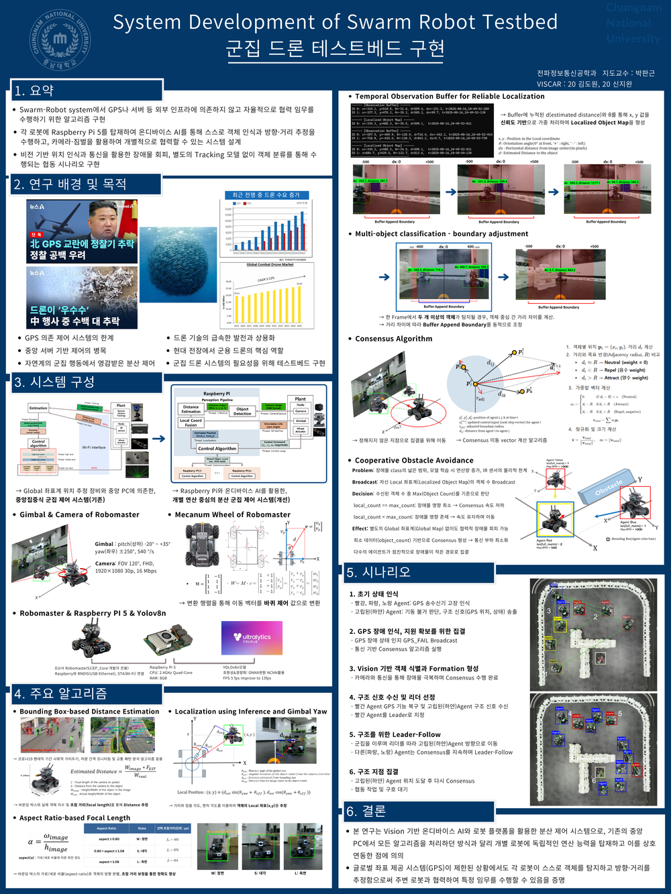
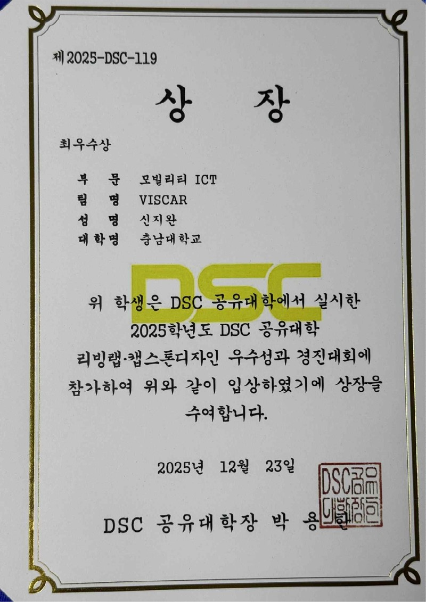

<div align="center">

# Vision-based Distributed Swarm Robot Control System

### GPS-Free · Server-Free · On-device AI · Distributed Consensus Control


**Vision 기반 온디바이스 AI와 최소 정보 통신을 활용한 분산 군집 로봇 제어 시스템**

</div>

---

## Demo

> 다수의 RoboMaster S1이 카메라 기반 객체 인식 결과와 UDP Broadcast를 활용하여 중앙 서버 없이 협력 이동하는 시연입니다.

<p align="center">
  
</p>

- Full demo video: [`assets/demo.mp4`](assets/demo.mp4)
- Poster: [`assets/poster.pdf`](assets/poster.pdf)
- Award: [`assets/award.pdf`](assets/award.pdf)

---

## Overview

본 프로젝트는 **Vision 기반 온디바이스 AI**를 활용하여 GPS 및 중앙 서버 없이도 다수의 로봇이 협력적으로 움직일 수 있는 **분산 자율 제어 시스템**을 구현하는 것을 목표로 합니다.

기존 중앙집중형 제어 시스템은 모든 인지·판단·제어 연산이 중앙 PC에 의존하기 때문에 서버 병목, 통신 지연, 단일 장애점, GPS 의존성 문제가 발생할 수 있습니다. 특히 실내 환경이나 GNSS-denied 환경에서는 안정적인 군집 제어가 어렵습니다.

이를 해결하기 위해 본 프로젝트에서는 각 로봇이 **Raspberry Pi 5 + Camera + RoboMaster S1** 구조를 기반으로 독립적인 객체 인식, 거리 추정, 방향 추정, 로컬 좌표 계산을 수행하고, 로봇 간에는 최소 정보만 UDP Broadcast로 공유하도록 설계했습니다.

---

## Problem Definition

| Challenge | Description |
|---|---|
| GPS-free localization | GPS가 제한된 환경에서 객체의 거리와 방향을 어떻게 추정할 것인가? |
| Server-free decision making | 중앙 서버 없이 다수 로봇의 이동 방향을 어떻게 결정할 것인가? |
| On-device real-time inference | 저사양 임베디드 환경에서 실시간 인지-판단-제어를 어떻게 구현할 것인가? |
| Communication efficiency | 군집 제어에 필요한 정보를 어떻게 최소화하여 공유할 것인가? |

---

## System Pipeline



---

## Core Architecture

<p align="center">
  
</p>

### 1. Perception

- YOLOv8n 기반 객체 탐지
- Bounding Box 기반 거리 추정
- Aspect Ratio 기반 객체 방향 추정
- Multi-object 상황에서 객체 중심 간 거리 차이를 이용한 boundary adjustment

### 2. Estimation

- Gimbal yaw와 추정 거리를 활용한 Local 좌표 계산
- Temporal Observation Buffer를 통한 노이즈 완화
- 로봇별 Localized Object Map 생성

### 3. Communication & Decision

- UDP Broadcast 기반 최소 정보 통신
- 각 로봇은 전체 좌표나 이미지를 공유하지 않고 `object_count` 중심의 최소 데이터만 송수신
- 수신된 object count의 최댓값을 기준으로 장애물 영향 정도를 판단
- Weighted Consensus 기반 이동 벡터 결정

### 4. Control

- Consensus 이동 벡터를 Mecanum Wheel 제어 값으로 변환
- 장애물 영향이 큰 로봇은 이동 속도를 유지하고, 영향이 작은 로봇은 속도를 조절하여 군집 방향을 정렬
- 별도의 Global Map 없이 협력적 장애물 회피 수행

---

## Key Features

- **GPS-Free**: 외부 위치 인프라 없이 카메라와 짐벌 정보를 이용해 객체 위치 추정
- **Server-Free**: 중앙 PC가 아닌 각 로봇의 Raspberry Pi에서 인지·판단 수행
- **On-device AI**: YOLOv8n을 ONNX/NCNN 기반으로 경량화하여 실시간 추론 수행
- **Distributed Consensus**: 로봇 간 최소 정보 공유를 기반으로 군집 이동 방향 결정
- **Cooperative Obstacle Avoidance**: Global Map 없이도 객체 수 기반 판단으로 장애물 영향이 적은 방향으로 집결

---

## Hardware & Software

| Category | Components |
|---|---|
| Robot Platform | DJI RoboMaster S1 / EP Core |
| Edge Device | Raspberry Pi 5, 8GB RAM |
| Vision Sensor | RoboMaster Camera & Gimbal |
| AI Model | YOLOv8n |
| Inference Runtime | ONNX, OpenCV DNN, NCNN |
| Communication | UDP Broadcast |
| Control | Python, Mecanum Wheel Control |

---

## Performance

| Metric | Result |
|---|---:|
| On-device inference speed | 10-15 FPS |
| Optimized YOLOv8n speed | 약 5 FPS -> 13 FPS |
| Distance estimation error | ±20-30 cm |
| Consensus convergence time | 평균 15초 이내 |

---

## Scenario

1. **Initial State Recognition**  
   로봇들이 GPS 송수신기 고장 상태를 인식하고, 고립된 Agent는 구조 신호를 송출합니다.

2. **Consensus-based Gathering**  
   GPS_FAIL Broadcast 이후 로봇들이 통신 기반 Consensus 알고리즘을 실행합니다.

3. **Vision-based Object Recognition**  
   각 로봇은 카메라와 짐벌을 통해 주변 객체를 인식하고 장애물 영향을 판단합니다.

4. **Leader Selection**  
   GPS 기능이 복구된 Agent가 Leader로 지정됩니다.

5. **Leader-Follow**  
   다른 Agent들은 Consensus를 유지하면서 Leader를 따라 구조 지점으로 이동합니다.

6. **Arrival & Re-consensus**  
   구조 지점에 도착한 뒤 다시 Consensus를 수행하여 협동 작업을 준비합니다.

---

## Repository Structure

```text
2025_Capstone_Design/
├── assets/
│   ├── demo.gif
│   ├── demo.mp4
│   ├── poster_preview.png
│   ├── poster.pdf
│   ├── award_preview.jpg
│   └── award.pdf
├── camera.py             # Camera frame acquisition
├── inference.py          # YOLOv8 inference pipeline
├── estimation.py         # Distance, direction, local position estimation
├── smoothing.py          # Temporal buffer and noise smoothing
├── communication.py      # UDP broadcast communication
├── control.py            # Consensus and mecanum wheel control
├── config.py             # System parameters
├── utils.py              # Utility functions
├── main.py               # Main execution entry point
├── requirements.txt
└── README.md
```

---

## How to Run

```bash
git clone https://github.com/jiwan1230/2025_Capstone_Design.git
cd 2025_Capstone_Design
pip install -r requirements.txt
python main.py
```

> 실제 RoboMaster S1 및 Raspberry Pi 네트워크 환경에서는 각 Agent의 IP, UDP port, camera index, model path를 `config.py`에서 환경에 맞게 수정해야 합니다.

---

## Award

<p align="center">
  
</p>

- 2025 DSC 공유대학 리빙랩·캡스톤디자인 우수성과 경진대회
- 모빌리티 ICT 부문 최우수상
- Team: VISCAR

---

## Contribution

- 중앙 서버 없이도 협력 가능한 분산 로봇 시스템 구현
- 단일 카메라 기반 거리 및 방향 추정 알고리즘 설계
- 저사양 임베디드 환경에서 실시간 AI 추론 최적화
- UDP Broadcast 기반 최소 통신 구조 설계
- Global 좌표계 없이 Local Object Map과 Consensus 기반 협력 장애물 회피 구현

---

## Team

| Name | Role |
|---|---|
| 김도원 | System integration, control scenario |
| 신지완 | Vision-based localization, on-device inference, distributed control |

Advisor: Prof. 박판근  
Department of Radio and Information Communications Engineering, Chungnam National University
